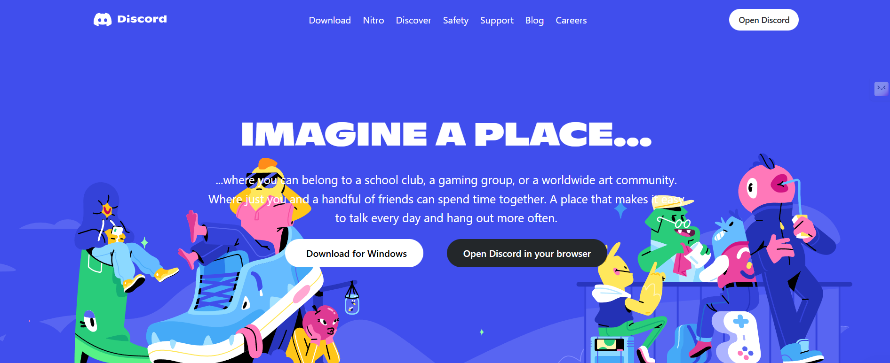

<!-- ---------------------------------------------------------- -->
<!-- CENTER TITLE -->
<h1 align="center">🎧 Discord Landing Page Clone</h1>

<p align="center">
  A clean, modern, and responsive clone of the Discord homepage.<br>
  Built using <b>HTML, CSS, TailwindCSS</b> to sharpen UI & layout skills.
</p>

<!-- BADGES -->
<p align="center">
  
  
  
</p>

---

## 🌐 Live Demo  
(https://discord-clone-frontend-theta.vercel.app)

---

## 📸 Preview  

<p align="center">
  
</p>


---

## 🚀 Features  
- 🎨 Pixel-perfect Discord UI replica  
- 📱 Fully responsive for all screen sizes  
- 🧩 Clean layout & folder structure  
- ⚡ TailwindCSS setup  
- 🗂️ Organized assets (fonts, images, components)  

---

## 🛠 Tech Stack  
| Technology | Purpose |
|-----------|----------|
| **HTML5** | Structure |
| **CSS3 / TailwindCSS** | Styling & layout |
| **JavaScript** | Interactions |

---

## 📂 Folder Structure

```bash
discordClone/
├── fonts/
├── images/
├── node_modules/         
├── index.html
├── main.css
├── tailwind.config.js
├── postcss.config.js
├── package.json
├── package-lock.json
├── .gitignore
└── README.md
```


---

## 🧪 How to Run Locally  

```bash
# Clone the repo
git clone https://github.com/PranavGoel26/Discord-clone-frontend.git

# Navigate into folder
cd discordClone

# Install dependencies
npm install

# Start Tailwind build
npx tailwindcss -i ./main.css -o ./dist/output.css --watch

# Open index.html in browser

```